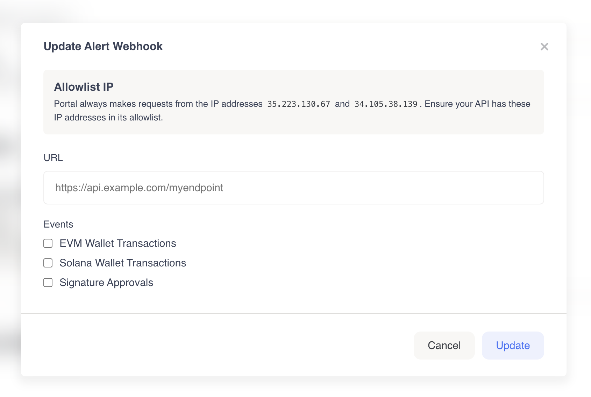

# Alert Webhooks

## What's an alert webhook?

Alert webhooks can send you realtime wallet notifications for your clients. For example, they can be useful for receiving notifications when your clients receive or send EVM transactions. Alert webhooks are easily configured in the Portal Admin Dashboard. If you don't see "Alert Webhooks" in the Portal Admin Dashboard, reach out to our team and we can enable the feature for you.

### Configuring alert webhooks

1. Reach out to our support team and we can enable alert webhooks for your organization.
2.  Navigate to `"Settings"` > `"Alert Webhooks"` in the [Portal Admin Dashboard](https://app.portalhq.io) and click `"New +"`.


    <figure><figcaption><p>Click "New +" in the "Alert Webhooks" section.</p></figcaption></figure>
3.  Enter your alert webhook URL:

    <figure><figcaption></figcaption></figure>
4. Select the events you want to receive (e.g. `EVM Wallet Transactions`).
5. Save your configuration.


Take note of the IP addresses listed on this modal. You can add them to your allowlist to ensure you're only accepting requests from Portal.


## Types of alerts

### `EVM Wallet Transactions`

Immediately after configuring the alert webhook with `EVM Wallet Transactions` selected as an event, Portal starts to listen for any inbound/outbound EIP-155 transactions for your clients that have an EIP-155 address. From then on when you create a new client with an EIP-155 address, Portal will notify you of their on-chain transactions.

When an EVM transaction occurs, Portal makes a `POST` request to your configured alert webhook URL with a request body that contains the alert webhook event's details. You will receive 2 alerts per transaction — The first alert is `unconfirmed` and, once the transaction receives sufficient confirmations, the second alert is `confirmed`.


`EVM Wallet Transactions` currently sends alerts with the following use cases:

1. Receive native tokens (ie. `ETH`) from another address
2. Send native tokens (ie. `ETH`) to another address
3. Receive non-native tokens (ie. `USDC`) from another address
4. Send non-native tokens (ie. `USDC`) to another address



When a block is unconfirmed, chain reorganizations may occur. If a reorganization happens, the original block's data is replaced with the updated block. This means you might receive an `unconfirmed` alert without a subsequent `confirmed` alert for the same transaction if this happens.



**Retries:** When your webhook does not respond to a request, or if you do not respond with a `2XX` status code, Portal will attempt to retry the request in intervals (1 minute, 10 minutes, 1 hour, 2 hours, 6 hours, 12 hours, and at 24 hours). If no successful response occurs during that timeframe, the webhook event will be dropped and you will need to [manually replay the event](alert-webhooks.md#high-reliability-2).


See the table below for all EVM chains we support for `EVM Wallet Transactions` alerts.

| Name             | Chain ID          | Blocks until confirmed |
| ---------------- | ----------------- | ---------------------- |
| Ethereum         | `eip155:1`        | `12`                   |
| Ethereum Sepolia | `eip155:11155111` | `18`                   |
| Polygon          | `eip155:137`      | `100`                  |
| Polygon Amoy     | `eip155:80002`    | `100`                  |
| Arbitrum         | `eip155:42161`    | `18`                   |
| Arbitrum Sepolia | `eip155:421614`   | `600`                  |
| Optimism         | `eip155:10`       | `500`                  |
| Optimism Sepolia | `eip155:11155420` | `600`                  |
| Base             | `eip155:8453`     | `100`                  |
| Base Sepolia     | `eip155:84532`    | `100`                  |

#### Headers:

| Name                                                 | Type   | Description                                                                                                                                                   |
| ---------------------------------------------------- | ------ | ------------------------------------------------------------------------------------------------------------------------------------------------------------- |
| `Content-Type`<mark style="color:red;">\*</mark>     | String | `application/json`                                                                                                                                            |
| `X-WEBHOOK-SECRET`<mark style="color:red;">\*</mark> | String | You can find the alert webhook secret in the [Portal Admin Dashboard](https://app.portalhq.io) on the `"Settings"` page under the `"Alert Webhooks"` section. |

#### Request body (examples)



**Unconfirmed alert:**

```javascript
{
  "data": [
    {
      "to": "0xab44dca8a4c606298d6be3e1b53115ed4785fe1d", // Your Portal wallet
      "from": "0x76acbd1eb20236f303d6f5fc3d50fe5f88caec3f",
      "amount": "0.01",
      "chainId": "eip155:11155111",
      "assetType": "NATIVE_TOKEN",
      "chainName": "sepolia",
      "direction": "INBOUND",
      "tokenSymbol": "ETH",
      "metadata": {
        "fee": {
          "amount": "0.001933021424187",
          "decimals": 18,
          "rawAmount": "1933021424187000",
          "tokenSymbol": "ETH"
        },
        "sentAt": "2025-02-05T14:44:00.000Z",
        "confirmed": false,
        "rawAmount": "10000000000000000",
        "tokenName": "ETH",
        "nftTokenId": null,
        "blockNumber": "7645517",
        "triggeredBy": "0xab44dca8a4c606298d6be3e1b53115ed4785fe1d",
        "tokenAddress": null,
        "tokenDecimals": 18,
        "approvalSpender": null,
        "transactionHash": "0xd3e43c0c352d6d60e16115416ae9d1406394e149096d449a7c88068f923ada8a",
        "userOperationHash": null
      }
    }
  ],
  "metadata": {
    "custodianId": "custodianId",
    "environmentId": "environmentId",
    "rawWebhookPayload": [],
  },
  "type": "EIP_155_TX_V1"
}
```

**Confirmed alert:**

```javascript
{
  "data": [
    {
      "to": "0xab44dca8a4c606298d6be3e1b53115ed4785fe1d", // Your Portal wallet
      "from": "0x76acbd1eb20236f303d6f5fc3d50fe5f88caec3f",
      "amount": "0.01",
      "chainId": "eip155:11155111",
      "assetType": "NATIVE_TOKEN",
      "chainName": "sepolia",
      "direction": "INBOUND",
      "tokenSymbol": "ETH",
      "metadata": {
        "fee": {
          "amount": "0.001933021424187",
          "decimals": 18,
          "rawAmount": "1933021424187000",
          "tokenSymbol": "ETH"
        },
        "sentAt": "2025-02-05T14:44:00.000Z",
        "confirmed": true,
        "rawAmount": "10000000000000000",
        "tokenName": "ETH",
        "nftTokenId": null,
        "blockNumber": "7645517",
        "triggeredBy": "0xab44dca8a4c606298d6be3e1b53115ed4785fe1d",
        "tokenAddress": null,
        "tokenDecimals": 18,
        "approvalSpender": null,
        "transactionHash": "0xd3e43c0c352d6d60e16115416ae9d1406394e149096d449a7c88068f923ada8a",
        "userOperationHash": null
      }
    }
  ],
  "metadata": {
    "custodianId": "custodianId",
    "environmentId": "environmentId",
    "rawWebhookPayload": []
  },
  "type": "EIP_155_TX_V1"
}
```



**Unconfirmed alert:**

```javascript
{
  "data": [
    {
      "to": "0xdfd8302f44727a6348f702ff7b594f127de3a902",
      "from": "0xab44dca8a4c606298d6be3e1b53115ed4785fe1d", // Your Portal wallet
      "amount": "0.001",
      "chainId": "eip155:11155111",
      "assetType": "NATIVE_TOKEN",
      "chainName": "sepolia",
      "direction": "OUTBOUND",
      "tokenSymbol": "ETH",
      "metadata": {
        "fee": {
          "amount": "0.001955140746657",
          "decimals": 18,
          "rawAmount": "1955140746657000",
          "tokenSymbol": "ETH"
        },
        "sentAt": "2025-02-05T14:52:24.000Z",
        "confirmed": false,
        "rawAmount": "1000000000000000",
        "tokenName": "ETH",
        "nftTokenId": null,
        "blockNumber": "7645557",
        "triggeredBy": "0xab44dca8a4c606298d6be3e1b53115ed4785fe1d",
        "tokenAddress": null,
        "tokenDecimals": 18,
        "approvalSpender": null,
        "transactionHash": "0x297602294abe88d847a0e74af600b149cf3ed31f4cd775b37628cead9b2fabb6",
        "userOperationHash": null
      }
    }
  ],
  "metadata": {
    "custodianId": "custodianId",
    "environmentId": "environmentId"
  },
  "type": "EIP_155_TX_V1"
}
```

**Confirmed alert:**

```javascript
{
  "data": [
    {
      "to": "0xdfd8302f44727a6348f702ff7b594f127de3a902",
      "from": "0xab44dca8a4c606298d6be3e1b53115ed4785fe1d", // Your Portal wallet
      "amount": "0.001",
      "chainId": "eip155:11155111",
      "assetType": "NATIVE_TOKEN",
      "chainName": "sepolia",
      "direction": "OUTBOUND",
      "tokenSymbol": "ETH",
      "metadata": {
        "fee": {
          "amount": "0.001955140746657",
          "decimals": 18,
          "rawAmount": "1955140746657000",
          "tokenSymbol": "ETH"
        },
        "sentAt": "2025-02-05T14:52:24.000Z",
        "confirmed": true,
        "rawAmount": "1000000000000000",
        "tokenName": "ETH",
        "nftTokenId": null,
        "blockNumber": "7645557",
        "triggeredBy": "0xab44dca8a4c606298d6be3e1b53115ed4785fe1d",
        "tokenAddress": null,
        "tokenDecimals": 18,
        "approvalSpender": null,
        "transactionHash": "0x297602294abe88d847a0e74af600b149cf3ed31f4cd775b37628cead9b2fabb6",
        "userOperationHash": null
      }
    }
  ],
  "metadata": {
    "custodianId": "custodianId",
    "environmentId": "environmentId"
  },
  "type": "EIP_155_TX_V1"
}
```



**Unconfirmed alert:**

```javascript
{
  "data": [
    {
      "to": "0xab44dca8a4c606298d6be3e1b53115ed4785fe1d", // Your Portal wallet
      "from": "0xdfd8302f44727a6348f702ff7b594f127de3a902",
      "amount": "2",
      "chainId": "eip155:11155111",
      "assetType": "NON_NATIVE_TOKEN",
      "chainName": "sepolia",
      "direction": "INBOUND",
      "tokenSymbol": "USDT",
      "metadata": {
        "fee": {
          "amount": "0.003163263549129086",
          "decimals": 18,
          "rawAmount": "3163263549129086",
          "tokenSymbol": "ETH"
        },
        "sentAt": "2025-02-05T16:50:12.000Z",
        "confirmed": false,
        "rawAmount": "2000000",
        "tokenName": "USDT",
        "nftTokenId": null,
        "blockNumber": "7646117",
        "triggeredBy": "0xab44dca8a4c606298d6be3e1b53115ed4785fe1d",
        "tokenAddress": "0x419fe9f14ff3aa22e46ff1d03a73edf3b70a62ed",
        "tokenDecimals": "6",
        "approvalSpender": null,
        "transactionHash": "0x165f68557bb15ca9396b58f9f71f5113b83affce4fe445b37728af6c3fdb3e48",
        "userOperationHash": null
      }
    }
  ],
  "metadata": {
    "custodianId": "custodianId",
    "environmentId": "environmentId"
  },
  "type": "EIP_155_TX_V1"
}
```

**Confirmed alert:**

```javascript
{
  "data": [
    {
      "to": "0xab44dca8a4c606298d6be3e1b53115ed4785fe1d", // Your Portal wallet
      "from": "0xdfd8302f44727a6348f702ff7b594f127de3a902",
      "amount": "2",
      "chainId": "eip155:11155111",
      "assetType": "NON_NATIVE_TOKEN",
      "chainName": "sepolia",
      "direction": "INBOUND",
      "tokenSymbol": "USDT",
      "metadata": {
        "fee": {
          "amount": "0.003163263549129086",
          "decimals": 18,
          "rawAmount": "3163263549129086",
          "tokenSymbol": "ETH"
        },
        "sentAt": "2025-02-05T16:50:12.000Z",
        "confirmed": true,
        "rawAmount": "2000000",
        "tokenName": "USDT",
        "nftTokenId": null,
        "blockNumber": "7646117",
        "triggeredBy": "0xab44dca8a4c606298d6be3e1b53115ed4785fe1d",
        "tokenAddress": "0x419fe9f14ff3aa22e46ff1d03a73edf3b70a62ed",
        "tokenDecimals": "6",
        "approvalSpender": null,
        "transactionHash": "0x165f68557bb15ca9396b58f9f71f5113b83affce4fe445b37728af6c3fdb3e48",
        "userOperationHash": null
      }
    }
  ],
  "metadata": {
    "custodianId": "custodianId",
    "environmentId": "environmentId"
  },
  "type": "EIP_155_TX_V1"
}
```



**Unconfirmed alert:**

```javascript
{
  "data": [
    {
      "to": "0xdfd8302f44727a6348f702ff7b594f127de3a902",
      "from": "0xab44dca8a4c606298d6be3e1b53115ed4785fe1d", // Your Portal wallet
      "amount": "0.1",
      "chainId": "eip155:11155111",
      "assetType": "NON_NATIVE_TOKEN",
      "chainName": "sepolia",
      "direction": "OUTBOUND",
      "tokenSymbol": "USDT",
      "metadata": {
        "fee": {
          "amount": "0.002395433635667721",
          "decimals": 18,
          "rawAmount": "2395433635667721",
          "tokenSymbol": "ETH"
        },
        "sentAt": "2025-02-05T16:58:36.000Z",
        "confirmed": false,
        "rawAmount": "100000",
        "tokenName": "USDT",
        "nftTokenId": null,
        "blockNumber": "7646155",
        "triggeredBy": "0xab44dca8a4c606298d6be3e1b53115ed4785fe1d",
        "tokenAddress": "0x419fe9f14ff3aa22e46ff1d03a73edf3b70a62ed",
        "tokenDecimals": "6",
        "approvalSpender": null,
        "transactionHash": "0xa1da1738225b012c328724454dd46db4279133cfbf4a3054c094f3986de9ffe0",
        "userOperationHash": null
      }
    }
  ],
  "metadata": {
    "custodianId": "custodianId",
    "environmentId": "environmentId"
  },
  "type": "EIP_155_TX_V1"
}
```

**Confirmed alert:**

```javascript
{
  "data": [
    {
      "to": "0xdfd8302f44727a6348f702ff7b594f127de3a902",
      "from": "0xab44dca8a4c606298d6be3e1b53115ed4785fe1d", // Your Portal wallet
      "amount": "0.1",
      "chainId": "eip155:11155111",
      "assetType": "NON_NATIVE_TOKEN",
      "chainName": "sepolia",
      "direction": "OUTBOUND",
      "tokenSymbol": "USDT",
      "metadata": {
        "fee": {
          "amount": "0.002395433635667721",
          "decimals": 18,
          "rawAmount": "2395433635667721",
          "tokenSymbol": "ETH"
        },
        "sentAt": "2025-02-05T16:58:36.000Z",
        "confirmed": true,
        "rawAmount": "100000",
        "tokenName": "USDT",
        "nftTokenId": null,
        "blockNumber": "7646155",
        "triggeredBy": "0xab44dca8a4c606298d6be3e1b53115ed4785fe1d",
        "tokenAddress": "0x419fe9f14ff3aa22e46ff1d03a73edf3b70a62ed",
        "tokenDecimals": "6",
        "approvalSpender": null,
        "transactionHash": "0xa1da1738225b012c328724454dd46db4279133cfbf4a3054c094f3986de9ffe0",
        "userOperationHash": null
      }
    }
  ],
  "metadata": {
    "custodianId": "custodianId",
    "environmentId": "environmentId"
  },
  "type": "EIP_155_TX_V1"
}
```



### `Solana Wallet Transactions`

Once you set up an alert webhook with `Solana Wallet Transactions` as the event, Portal begins monitoring _transfer_ transactions for your Portal clients with a Solana address. Any new client created with a Solana address will also trigger notifications for their on-chain transfers.

When a Solana transfer transaction occurs, Portal makes a `POST` request to your configured alert webhook URL with a request body that contains the alert webhook event's details. You will receive 1 alert when the transaction is `confirmed`.


`Solana Wallet Transactions` currently sends alerts with the following use cases:

1. Receive native tokens (ie. `SOL`) from another address
2. Send native tokens (ie. `SOL`) to another address
3. Receive non-native tokens (ie. `USDC`) from another address
4. Send non-native tokens (ie. `USDC`) to another address



Solana alert webhooks support **up to 100,000 addresses**. Contact our team if you require additional capacity.



After you create a new Portal client wallet, it can take **up to 4 minutes** before you start to receive Solana transaction events for them.



**Retries:** When your webhook does not respond to a request, or if you do not respond with a `2XX` status code, Portal will attempt to retry the request once per minute for 3 minutes. If no successful response occurs during that timeframe, the webhook event will be dropped.


#### Headers:

| Name                                                 | Type   | Description                                                                                                                                                   |
| ---------------------------------------------------- | ------ | ------------------------------------------------------------------------------------------------------------------------------------------------------------- |
| `Content-Type`<mark style="color:red;">\*</mark>     | String | `application/json`                                                                                                                                            |
| `X-WEBHOOK-SECRET`<mark style="color:red;">\*</mark> | String | You can find the alert webhook secret in the [Portal Admin Dashboard](https://app.portalhq.io) on the `"Settings"` page under the `"Alert Webhooks"` section. |

#### Request body (examples)



```json
{
  "data": {
    "rawEvents": [
      {
        "fee": 80000,
        "slot": 379135212,
        "type": "TRANSFER",
        "events": {},
        "source": "SYSTEM_PROGRAM",
        "feePayer": "75ZfLXXsSpycDvHTQuHnGQuYgd2ihb6Bu4viiCCQ7P4H",
        "signature": "5hyWP82Fn951zjo5DHWAvAC8NjwU7LAKqR3Rpn7sB1H159koer8BefYSSCRuC7X3xVy6rHvMzM7sYHLBwxTAEeUY",
        "timestamp": 1746565669,
        "accountData": [
          {
            "account": "75ZfLXXsSpycDvHTQuHnGQuYgd2ihb6Bu4viiCCQ7P4H",
            "nativeBalanceChange": -10080000,
            "tokenBalanceChanges": []
          },
          {
            "account": "67vPQk4SMRRmZdcfyRd6kBggyeca6TqWmsAkJatNDHyx",
            "nativeBalanceChange": 10000000,
            "tokenBalanceChanges": []
          },
          {
            "account": "11111111111111111111111111111111",
            "nativeBalanceChange": 0,
            "tokenBalanceChanges": []
          },
          {
            "account": "ComputeBudget111111111111111111111111111111",
            "nativeBalanceChange": 0,
            "tokenBalanceChanges": []
          }
        ],
        "description": "75ZfLXXsSpycDvHTQuHnGQuYgd2ihb6Bu4viiCCQ7P4H transferred 0.01 SOL to 67vPQk4SMRRmZdcfyRd6kBggyeca6TqWmsAkJatNDHyx.",
        "instructions": [
          {
            "data": "3b1H8Rq1T3d1",
            "accounts": [],
            "programId": "ComputeBudget111111111111111111111111111111",
            "innerInstructions": []
          },
          {
            "data": "LKoyXd",
            "accounts": [],
            "programId": "ComputeBudget111111111111111111111111111111",
            "innerInstructions": []
          },
          {
            "data": "3Bxs4NN8M2Yn4TLb",
            "accounts": [
              "75ZfLXXsSpycDvHTQuHnGQuYgd2ihb6Bu4viiCCQ7P4H",
              "67vPQk4SMRRmZdcfyRd6kBggyeca6TqWmsAkJatNDHyx"
            ],
            "programId": "11111111111111111111111111111111",
            "innerInstructions": []
          }
        ],
        "tokenTransfers": [],
        "nativeTransfers": [
          {
            "amount": 10000000,
            "toUserAccount": "67vPQk4SMRRmZdcfyRd6kBggyeca6TqWmsAkJatNDHyx",
            "fromUserAccount": "75ZfLXXsSpycDvHTQuHnGQuYgd2ihb6Bu4viiCCQ7P4H"
          }
        ],
        "transactionError": null
      }
    ]
  },
  "metadata": {
    "isDevnet": true,
    "eventTypes": ["TRANSFER"],
    "environmentId": "environmentId"
  },
  "type": "SOLANA_TX_V1"
}
```



```json
{
  "data": {
    "rawEvents": [
      {
        "fee": 5000,
        "slot": 379135804,
        "type": "TRANSFER",
        "events": {},
        "source": "SYSTEM_PROGRAM",
        "feePayer": "67vPQk4SMRRmZdcfyRd6kBggyeca6TqWmsAkJatNDHyx",
        "signature": "KENcRJpHNowJcpDwPvB2yR6VnDzMbQu5Nd1om5K1Y3cjdS3ujStBWYtz3EMhY1UvzykShhdZSUShwZrmYWbxfAF",
        "timestamp": 1746565903,
        "accountData": [
          {
            "account": "67vPQk4SMRRmZdcfyRd6kBggyeca6TqWmsAkJatNDHyx",
            "nativeBalanceChange": -205000,
            "tokenBalanceChanges": []
          },
          {
            "account": "75ZfLXXsSpycDvHTQuHnGQuYgd2ihb6Bu4viiCCQ7P4H",
            "nativeBalanceChange": 200000,
            "tokenBalanceChanges": []
          },
          {
            "account": "11111111111111111111111111111111",
            "nativeBalanceChange": 0,
            "tokenBalanceChanges": []
          }
        ],
        "description": "67vPQk4SMRRmZdcfyRd6kBggyeca6TqWmsAkJatNDHyx transferred 0.0002 SOL to 75ZfLXXsSpycDvHTQuHnGQuYgd2ihb6Bu4viiCCQ7P4H.",
        "instructions": [
          {
            "data": "3Bxs4Ba2u7BkmhYB",
            "accounts": [
              "67vPQk4SMRRmZdcfyRd6kBggyeca6TqWmsAkJatNDHyx",
              "75ZfLXXsSpycDvHTQuHnGQuYgd2ihb6Bu4viiCCQ7P4H"
            ],
            "programId": "11111111111111111111111111111111",
            "innerInstructions": []
          }
        ],
        "tokenTransfers": [],
        "nativeTransfers": [
          {
            "amount": 200000,
            "toUserAccount": "75ZfLXXsSpycDvHTQuHnGQuYgd2ihb6Bu4viiCCQ7P4H",
            "fromUserAccount": "67vPQk4SMRRmZdcfyRd6kBggyeca6TqWmsAkJatNDHyx"
          }
        ],
        "transactionError": null
      }
    ]
  },
  "metadata": {
    "isDevnet": true,
    "eventTypes": ["TRANSFER"],
    "environmentId": "environmentId"
  },
  "type": "SOLANA_TX_V1"
}
```



```json
{
  "data": {
    "rawEvents": [
      {
        "fee": 80000,
        "slot": 379136813,
        "type": "TRANSFER",
        "events": {},
        "source": "SOLANA_PROGRAM_LIBRARY",
        "feePayer": "75ZfLXXsSpycDvHTQuHnGQuYgd2ihb6Bu4viiCCQ7P4H",
        "signature": "3AH7LPWnzvqmQRkGWMECe7Hxmi6M4FurCrGxAfS4JP7YNVz81qQhwsX7YmHdQxA1bfGFPDc8ouHXuhncXPnT3Uf9",
        "timestamp": 1746566300,
        "accountData": [
          {
            "account": "75ZfLXXsSpycDvHTQuHnGQuYgd2ihb6Bu4viiCCQ7P4H",
            "nativeBalanceChange": -2119280,
            "tokenBalanceChanges": []
          },
          {
            "account": "4hi76XkyLMVtuPunTUH8SMYGbKshhcGufSfZEUkWvj9v",
            "nativeBalanceChange": 2039280,
            "tokenBalanceChanges": [
              {
                "mint": "4zMMC9srt5Ri5X14GAgXhaHii3GnPAEERYPJgZJDncDU",
                "userAccount": "67vPQk4SMRRmZdcfyRd6kBggyeca6TqWmsAkJatNDHyx",
                "tokenAccount": "4hi76XkyLMVtuPunTUH8SMYGbKshhcGufSfZEUkWvj9v",
                "rawTokenAmount": {
                  "decimals": 6,
                  "tokenAmount": "100000"
                }
              }
            ]
          },
          {
            "account": "CoDtJspas5BkRaxA8GTrzLZGTAMcsoec4oTrrVjwrJqA",
            "nativeBalanceChange": 0,
            "tokenBalanceChanges": [
              {
                "mint": "4zMMC9srt5Ri5X14GAgXhaHii3GnPAEERYPJgZJDncDU",
                "userAccount": "75ZfLXXsSpycDvHTQuHnGQuYgd2ihb6Bu4viiCCQ7P4H",
                "tokenAccount": "CoDtJspas5BkRaxA8GTrzLZGTAMcsoec4oTrrVjwrJqA",
                "rawTokenAmount": {
                  "decimals": 6,
                  "tokenAmount": "-100000"
                }
              }
            ]
          },
          {
            "account": "11111111111111111111111111111111",
            "nativeBalanceChange": 0,
            "tokenBalanceChanges": []
          },
          {
            "account": "4zMMC9srt5Ri5X14GAgXhaHii3GnPAEERYPJgZJDncDU",
            "nativeBalanceChange": 0,
            "tokenBalanceChanges": []
          },
          {
            "account": "67vPQk4SMRRmZdcfyRd6kBggyeca6TqWmsAkJatNDHyx",
            "nativeBalanceChange": 0,
            "tokenBalanceChanges": []
          },
          {
            "account": "ATokenGPvbdGVxr1b2hvZbsiqW5xWH25efTNsLJA8knL",
            "nativeBalanceChange": 0,
            "tokenBalanceChanges": []
          },
          {
            "account": "ComputeBudget111111111111111111111111111111",
            "nativeBalanceChange": 0,
            "tokenBalanceChanges": []
          },
          {
            "account": "SysvarRent111111111111111111111111111111111",
            "nativeBalanceChange": 0,
            "tokenBalanceChanges": []
          },
          {
            "account": "TokenkegQfeZyiNwAJbNbGKPFXCWuBvf9Ss623VQ5DA",
            "nativeBalanceChange": 0,
            "tokenBalanceChanges": []
          }
        ],
        "description": "75ZfLXXsSpycDvHTQuHnGQuYgd2ihb6Bu4viiCCQ7P4H transferred 0.1 4zMMC9srt5Ri5X14GAgXhaHii3GnPAEERYPJgZJDncDU to 67vPQk4SMRRmZdcfyRd6kBggyeca6TqWmsAkJatNDHyx.",
        "instructions": [
          {
            "data": "3pyz49iBVPDH",
            "accounts": [],
            "programId": "ComputeBudget111111111111111111111111111111",
            "innerInstructions": []
          },
          {
            "data": "Ejyj83",
            "accounts": [],
            "programId": "ComputeBudget111111111111111111111111111111",
            "innerInstructions": []
          },
          {
            "data": "",
            "accounts": [
              "75ZfLXXsSpycDvHTQuHnGQuYgd2ihb6Bu4viiCCQ7P4H",
              "4hi76XkyLMVtuPunTUH8SMYGbKshhcGufSfZEUkWvj9v",
              "67vPQk4SMRRmZdcfyRd6kBggyeca6TqWmsAkJatNDHyx",
              "4zMMC9srt5Ri5X14GAgXhaHii3GnPAEERYPJgZJDncDU",
              "11111111111111111111111111111111",
              "TokenkegQfeZyiNwAJbNbGKPFXCWuBvf9Ss623VQ5DA",
              "SysvarRent111111111111111111111111111111111"
            ],
            "programId": "ATokenGPvbdGVxr1b2hvZbsiqW5xWH25efTNsLJA8knL",
            "innerInstructions": [
              {
                "data": "84eT",
                "accounts": [
                  "4zMMC9srt5Ri5X14GAgXhaHii3GnPAEERYPJgZJDncDU"
                ],
                "programId": "TokenkegQfeZyiNwAJbNbGKPFXCWuBvf9Ss623VQ5DA"
              },
              {
                "data": "11119os1e9qSs2u7TsThXqkBSRVFxhmYaFKFZ1waB2X7armDmvK3p5GmLdUxYdg3h7QSrL",
                "accounts": [
                  "75ZfLXXsSpycDvHTQuHnGQuYgd2ihb6Bu4viiCCQ7P4H",
                  "4hi76XkyLMVtuPunTUH8SMYGbKshhcGufSfZEUkWvj9v"
                ],
                "programId": "11111111111111111111111111111111"
              },
              {
                "data": "P",
                "accounts": [
                  "4hi76XkyLMVtuPunTUH8SMYGbKshhcGufSfZEUkWvj9v"
                ],
                "programId": "TokenkegQfeZyiNwAJbNbGKPFXCWuBvf9Ss623VQ5DA"
              },
              {
                "data": "6SFd4LwbEeGhbq7iC4apSEA85UYCPWD7DUnLboAaBWSQv",
                "accounts": [
                  "4hi76XkyLMVtuPunTUH8SMYGbKshhcGufSfZEUkWvj9v",
                  "4zMMC9srt5Ri5X14GAgXhaHii3GnPAEERYPJgZJDncDU"
                ],
                "programId": "TokenkegQfeZyiNwAJbNbGKPFXCWuBvf9Ss623VQ5DA"
              }
            ]
          },
          {
            "data": "i9TTqffgKmDLh",
            "accounts": [
              "CoDtJspas5BkRaxA8GTrzLZGTAMcsoec4oTrrVjwrJqA",
              "4zMMC9srt5Ri5X14GAgXhaHii3GnPAEERYPJgZJDncDU",
              "4hi76XkyLMVtuPunTUH8SMYGbKshhcGufSfZEUkWvj9v",
              "75ZfLXXsSpycDvHTQuHnGQuYgd2ihb6Bu4viiCCQ7P4H",
              "75ZfLXXsSpycDvHTQuHnGQuYgd2ihb6Bu4viiCCQ7P4H"
            ],
            "programId": "TokenkegQfeZyiNwAJbNbGKPFXCWuBvf9Ss623VQ5DA",
            "innerInstructions": []
          }
        ],
        "tokenTransfers": [
          {
            "mint": "4zMMC9srt5Ri5X14GAgXhaHii3GnPAEERYPJgZJDncDU",
            "tokenAmount": 0.1,
            "toUserAccount": "67vPQk4SMRRmZdcfyRd6kBggyeca6TqWmsAkJatNDHyx",
            "tokenStandard": "Fungible",
            "toTokenAccount": "4hi76XkyLMVtuPunTUH8SMYGbKshhcGufSfZEUkWvj9v",
            "fromUserAccount": "75ZfLXXsSpycDvHTQuHnGQuYgd2ihb6Bu4viiCCQ7P4H",
            "fromTokenAccount": "CoDtJspas5BkRaxA8GTrzLZGTAMcsoec4oTrrVjwrJqA"
          }
        ],
        "nativeTransfers": [
          {
            "amount": 2039280,
            "toUserAccount": "4hi76XkyLMVtuPunTUH8SMYGbKshhcGufSfZEUkWvj9v",
            "fromUserAccount": "75ZfLXXsSpycDvHTQuHnGQuYgd2ihb6Bu4viiCCQ7P4H"
          }
        ],
        "transactionError": null
      }
    ]
  },
  "metadata": {
    "isDevnet": true,
    "eventTypes": ["TRANSFER"],
    "environmentId": "environmentId"
  },
  "type": "SOLANA_TX_V1"
}
```



```json
{
  "data": {
    "rawEvents": [
      {
        "fee": 5000,
        "slot": 379137198,
        "type": "TRANSFER",
        "events": {},
        "source": "SOLANA_PROGRAM_LIBRARY",
        "feePayer": "67vPQk4SMRRmZdcfyRd6kBggyeca6TqWmsAkJatNDHyx",
        "signature": "yqQnyoqB1cm5se1U4Da6Hr89mNvozzp5WULtkNSUP3jVH5c79whZ9zg2NXeQhV3c3wkmsVjPV627WZtfCaAeRJW",
        "timestamp": 1746566451,
        "accountData": [
          {
            "account": "67vPQk4SMRRmZdcfyRd6kBggyeca6TqWmsAkJatNDHyx",
            "nativeBalanceChange": -5000,
            "tokenBalanceChanges": []
          },
          {
            "account": "4hi76XkyLMVtuPunTUH8SMYGbKshhcGufSfZEUkWvj9v",
            "nativeBalanceChange": 0,
            "tokenBalanceChanges": [
              {
                "mint": "4zMMC9srt5Ri5X14GAgXhaHii3GnPAEERYPJgZJDncDU",
                "userAccount": "67vPQk4SMRRmZdcfyRd6kBggyeca6TqWmsAkJatNDHyx",
                "tokenAccount": "4hi76XkyLMVtuPunTUH8SMYGbKshhcGufSfZEUkWvj9v",
                "rawTokenAmount": {
                  "decimals": 6,
                  "tokenAmount": "-10000"
                }
              }
            ]
          },
          {
            "account": "CoDtJspas5BkRaxA8GTrzLZGTAMcsoec4oTrrVjwrJqA",
            "nativeBalanceChange": 0,
            "tokenBalanceChanges": [
              {
                "mint": "4zMMC9srt5Ri5X14GAgXhaHii3GnPAEERYPJgZJDncDU",
                "userAccount": "75ZfLXXsSpycDvHTQuHnGQuYgd2ihb6Bu4viiCCQ7P4H",
                "tokenAccount": "CoDtJspas5BkRaxA8GTrzLZGTAMcsoec4oTrrVjwrJqA",
                "rawTokenAmount": {
                  "decimals": 6,
                  "tokenAmount": "10000"
                }
              }
            ]
          },
          {
            "account": "TokenkegQfeZyiNwAJbNbGKPFXCWuBvf9Ss623VQ5DA",
            "nativeBalanceChange": 0,
            "tokenBalanceChanges": []
          }
        ],
        "description": "67vPQk4SMRRmZdcfyRd6kBggyeca6TqWmsAkJatNDHyx transferred 0.01 4zMMC9srt5Ri5X14GAgXhaHii3GnPAEERYPJgZJDncDU to 75ZfLXXsSpycDvHTQuHnGQuYgd2ihb6Bu4viiCCQ7P4H.",
        "instructions": [
          {
            "data": "3GAG5eogvTjV",
            "accounts": [
              "4hi76XkyLMVtuPunTUH8SMYGbKshhcGufSfZEUkWvj9v",
              "CoDtJspas5BkRaxA8GTrzLZGTAMcsoec4oTrrVjwrJqA",
              "67vPQk4SMRRmZdcfyRd6kBggyeca6TqWmsAkJatNDHyx"
            ],
            "programId": "TokenkegQfeZyiNwAJbNbGKPFXCWuBvf9Ss623VQ5DA",
            "innerInstructions": []
          }
        ],
        "tokenTransfers": [
          {
            "mint": "4zMMC9srt5Ri5X14GAgXhaHii3GnPAEERYPJgZJDncDU",
            "tokenAmount": 0.01,
            "toUserAccount": "75ZfLXXsSpycDvHTQuHnGQuYgd2ihb6Bu4viiCCQ7P4H",
            "tokenStandard": "Fungible",
            "toTokenAccount": "CoDtJspas5BkRaxA8GTrzLZGTAMcsoec4oTrrVjwrJqA",
            "fromUserAccount": "67vPQk4SMRRmZdcfyRd6kBggyeca6TqWmsAkJatNDHyx",
            "fromTokenAccount": "4hi76XkyLMVtuPunTUH8SMYGbKshhcGufSfZEUkWvj9v"
          }
        ],
        "nativeTransfers": [],
        "transactionError": null
      }
    ]
  },
  "metadata": {
    "isDevnet": true,
    "eventTypes": ["TRANSFER"],
    "environmentId": "environmentId"
  },
  "type": "SOLANA_TX_V1"
}
```



### `Signature Approvals`

After enabling `Signature Approvals`, Portal will make a request to your configured alert webhook URL any time that one of your Portal wallets attempt to sign. This request will contain the `chainId`, `clientId`, and `signingRequest`, which you can use to derive if the signing request should be allowed to continue.

You must respond with a status code of `200-299` for the signing request to continue. To deny the request, you must respond with a `400` status code. **If any other status code is received, or if 30 seconds passes with no response from your API, we will deny the signing request.**


If your API does not respond to `Signature Approval` alerts, your Portal clients' signing requests will be denied to ensure Portal only continues processing the signing request when your API gives explicit permission to do so.


#### Headers:

| Name                                                 | Type   | Description                                                                                                                                                   |
| ---------------------------------------------------- | ------ | ------------------------------------------------------------------------------------------------------------------------------------------------------------- |
| `Content-Type`<mark style="color:red;">\*</mark>     | String | `application/json`                                                                                                                                            |
| `X-WEBHOOK-SECRET`<mark style="color:red;">\*</mark> | String | You can find the alert webhook secret in the [Portal Admin Dashboard](https://app.portalhq.io) on the `"Settings"` page under the `"Alert Webhooks"` section. |

#### Request body (examples):



```javascript
{
  "data": {
    "chainId": "eip155:11155111", // Ethereum Sepolia
    "clientId": "clientId",
    "signingRequest": {
      "method": "eth_sendTransaction",
      "params": "{\"from\":\"0xec445db8df2208dde9b5ad87e77b6a4d45855d4f\",\"to\":\"0xdFd8302f44727A6348F702fF7B594f127dE3A902\",\"value\":\"0x5af3107a4000\"}"
    }
  },
  "metadata": {
    "custodianId": "custodianId",
    "environmentId": "environmentId",
    "signatureApprovalMemo": "optional memo"
  },
  "type": "PRE_SIGN_V1"
}
```



```javascript
{
  "data": {
    "chainId": "solana:EtWTRABZaYq6iMfeYKouRu166VU2xqa1", // Solana Devnet
    "clientId": "clientId",
    "signingRequest": {
      "method": "sol_signAndSendTransaction",
      "params": "AQAAAAAAAAAAAAAAAAAAAAAAAAAAAAAAAAAAAAAAAAAAAAAAAAAAAAAAAAAAAAAAAAAAAAAAAAAAAAAAAAAAAAABAAED4QZTgurPkrah5b0uP9SoRjT2+hCnv/1KSr7nRZWS8aJaUV/q8rCkYm5Cw38QFa6J0WVbD1/rY7eCTuE2Bz8jVgAAAAAAAAAAAAAAAAAAAAAAAAAAAAAAAAAAAAAAAAAAgje1UaxreFr4adOu8Z+RYX073+qUrItkboInHuIhJsQBAgIAAQwCAAAAQEIPAAAAAAA=" // base64 serialized transaction
    }
  },
  "metadata": {
    "custodianId": "custodianId",
    "environmentId": "environmentId",
    "signatureApprovalMemo": "optional memo"
  },
  "type": "PRE_SIGN_V1"
}
```



```javascript
{
  "data": {
    "chainId": "tron:nile", // Tron Nile Testnet
    "clientId": "clientId",
    "signingRequest": {
      "method": "tron_sendTransaction",
      "params": "CgJIziIID1+8YyspzttA0JCXytIyWmYIARJiCi10eXBlLmdvb2dsZWFwaXMuY29tL3Byb3RvY29sLlRyYW5zZmVyQ29udHJhY3QSMQoVQWbePJYEuac1QStQiExU4/oKJzizEhVBAtvp5WmlMcd8vqwl2REpbKTUQ6EY6Adw8LuTytIy"
    }
  },
  "metadata": {
    "custodianId": "custodianId",
    "environmentId": "environmentId",
    "signatureApprovalMemo": "optional memo"
  },
  "type": "PRE_SIGN_V1"
}
```



```javascript
{
  "data": {
    "chainId": "stellar:testnet", // Stellar Testnet
    "clientId": "clientId",
    "signingRequest": {
      "method": "stellar_sendTransaction",
      "params": "AAAAAgAAAADhBlOC6s+StqHlvS4/1KhGNPb6EKe//UpKvudFlZLxogAAAGQAEwrRAAAAAQAAAAEAAAAAAAAAAAAAAAAAAAAAAAAAAAAAAAEAAAAAAAAAAQAAAADNomLKKfoL22U8hEmltigZsRZo6o6YhQHvKPjsDTu5yAAAAAAAAAAAAAAnEAAAAAAAAAAA"
    }
  },
  "metadata": {
    "custodianId": "custodianId",
    "environmentId": "environmentId",
    "signatureApprovalMemo": "optional memo"
  },
  "type": "PRE_SIGN_V1"
}
```



## Security <a href="#high-reliability" id="high-reliability"></a>

Here are a few considerations to ensure your alert webhooks are implemented securely:

* Alert webhook URLs must use `HTTPS`.
* Verify that each alert webhook request has the expected `X-WEBHOOK-SECRET` header value. You can find the secret for your alert webhook in the [Portal Admin Dashboard](https://app.portalhq.io).
* Restricting requests on your alert webhook server to only those from Portal's IP addresses protects against requests from other parties. Configure your alert webhook server to only accept inbound connections from our IP addresses. Portal always makes requests from the IP addresses `35.203.150.117`, `104.155.171.139` or `35.185.20.23`.

## Example Implementation

We provide a [reference implementation](https://github.com/portal-hq/portal-alert-webhooks-example) of alert webhooks using TypeScript and Express. This example demonstrates best practices for handling alert webhook events, including:

* 🔒 IP address verification
* 🔑 Webhook secret validation
* ⚡ Async event processing

You can use this as a starting point for your own implementation:

```bash
git clone https://github.com/portal-hq/portal-alert-webhooks-example
cd portal-alert-webhooks-example
npm install
```

## FAQ <a href="#high-reliability" id="high-reliability"></a>

### What if I miss an alert webhook event? <a href="#high-reliability" id="high-reliability"></a>

* If your alert webhook is down or is not responding with `2xx` status codes, Portal will retry sending the alert webhook event.
  * For Solana webhook events, we retry once every minute for 3 minutes.
  * For EIP-155 webhook events, we retry 6 times progressively over 24 hours.
* If your EIP-155 alert webhook fails to receive the event:
  * You can find all of your alert webhooks using [this endpoint](https://docs.portalhq.io/reference/custodian-api/v3-endpoints#get-a-list-of-alert-webhooks).
  * You can then find an alert webhook's associated events using [this endpoint](https://docs.portalhq.io/reference/custodian-api/v3-endpoints#get-a-list-of-events-sent-to-your-alert-webhook).
  * You can replay the exact alert webhook event that failed to be delivered using [this endpoint](https://docs.portalhq.io/reference/custodian-api/v3-endpoints#replay-failed-to-deliver-alert-webhook-events).

### Should I process webhook events before responding?

No. Please **acknowledge webhooks as quickly as possible**. If you need to process the alert webhook event you receive, process it _after_ responding to Portal with a `2xx` status code. (We only wait up to 10 seconds to receive a response before considering the alert webhook event's delivery as `failed`.)

## Support

And that's it! :tada: You've now implemented alert webhooks and are receiving realtime wallet notifications for your Portal clients! As always, please reach out to our team if you have any questions.
